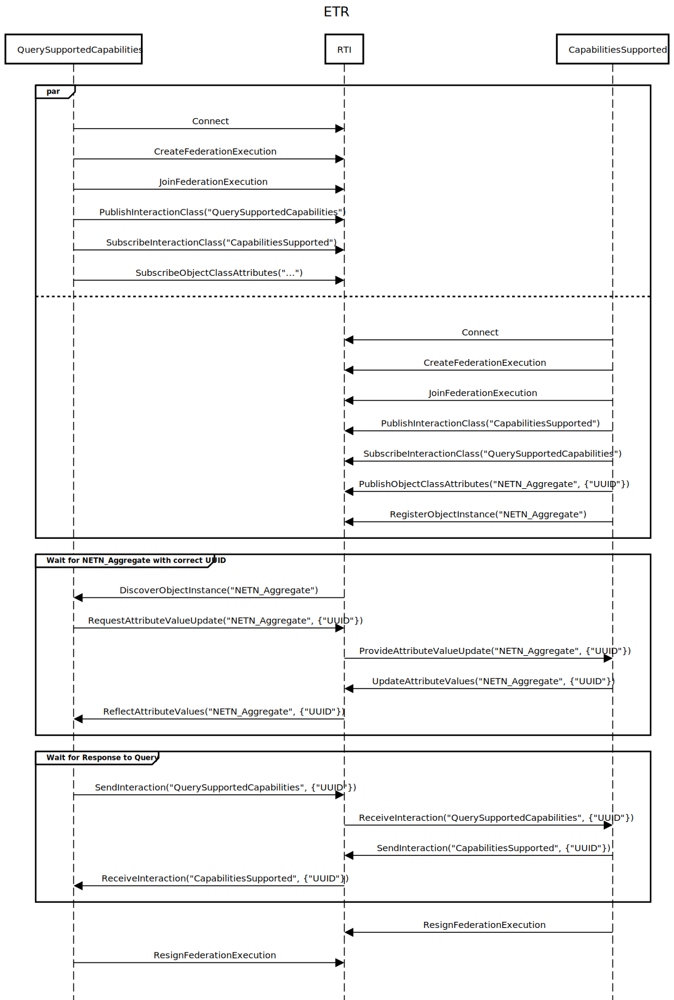

# ETR-Test-Federates

Repository for test federates that support testing of compliance with aspects of the NATO FOM for Distributed Synthetic Training (aka. NETN FOM).
All federates will connect to an HLA RTI, e.g. Pitch pRTI or MÄK RTI, using the standard HLA IEEE 1516-2010 Java API. The RTI is not provided, contact vendors for commercial, evaluation or personal education/test licences. The RTI java libraries must be linked to compile and run the test federates.

## Entity Tasking and Reporting (NETN-FOM) related tests
Query and Responding to identify which ETR tasks are suported.
Use this test federates to verify that your federate can request or respond to the NETN-ETR QuerySupportedCapabilities interaction.

### Testing your federate's ability to respond to a QuerySupportedCapabilities
### Testing your federate's ability to send QuerySupportedCapabilities

